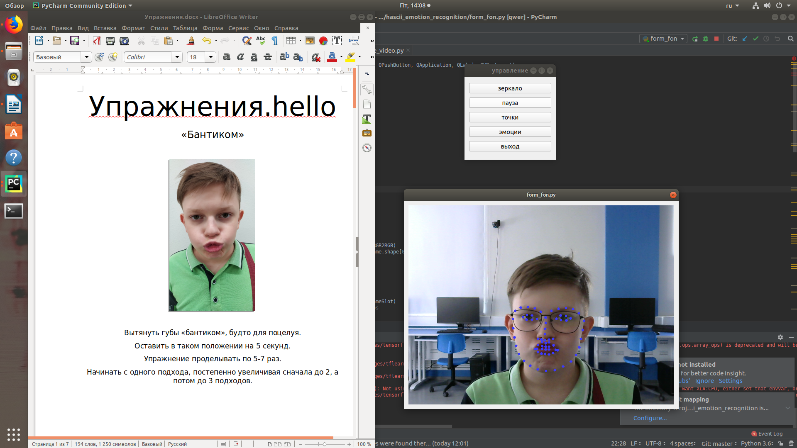
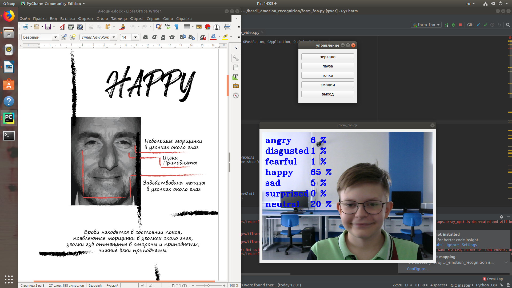

  

Surface
-------
**Surface** — это приложение,разработанное командой hello, которое способно облегчить процесс реабилитации людей, переживших инсульт.  С помощью web камеры пользователь сможет в режиме реального времени выполнять упражнения и восстанавливать нормальную подвижность мимических мышц. В отличие от обычного зеркала наше приложение способно идентифицировать мимические мышцы и следить за ними, а также определять эмоции.

### Surface работает в двух режимах. 

**Первый режим** — это выполнение упражнений. К программе предоставляется документация базовых заданий (word документ "Упражнения" в корневом каталоге), которые необходимо выполнять для восстановление мышц лица, в процессе выполнения упражнений на лице отображаются контрольные точки с помощью, которых в будущем планируется вести мониторинг прогресса (следить за изменением подвижность мышц вычисляя координаты точки).

  

**Второй режим** — это проверка на способность корректно выражать эмоции. Программа с помощью нейронной сети способно детектировать 7 базовых эмоций (радость, удивление, грусть, злость, отвращение, страх, нейтральная эмоция) и выводить результат на экран в виде процентной вероятности. Также к программе предоставляется документация по тому, как правильно следует выражать конкретную эмоцию (word документ "Эмоции" в корневом каталоге).

  

## Описание

Приложение состоит из двух несвязанных частей.

С помощью первой части производится исследование на сравнение работы двух классификаторов Виолы-Джонса и гистограммы направленных градиентов (HOG).

**find-face-photo-test.py** — с помощью данного скрипта тестируется работа двух детекторов лиц (Виолы-Джонса и HOG) на фотографиях людей страдающих нарушением работы мимических мышц. 

**find-face-video_test.py** — проверка двух классификаторов на тестовом видео. Результаты показали что HOG немного точнее чем метод Виолы-Джонса.

Вторая часть программа с графическим интерфейсом для пользователей.

**find-face-video.py** — часть приложения которое определяет лицо и ключевые точки

**emotion_video.py** — скрипт определяет эмоции

**neural_network.py** — скрипт нейронной сети 

**form_fon.py** — пользовательский интерфейс, написанный с помощью библиотеки PyQt5 (именно тот файл, который нужно запускать)

С помощью интерфейса вы можете включить режим зеркала (просто запись с web камеры), включить отображение ключевых точек для выполнения упражнений или режим распознавания эмоций. Также есть возможность поставить трансляцию на паузу.

## Установка dlib на Linux

`sudo apt-get install build-essential cmake`

`sudo apt-get install libgtk-3-dev`

`sudo apt-get install libboost-all-dev`

`pip install dlib`

Если вы используете windows, то прежде, чем установить dlib необходимо установить следующие компоненты

`Visual Studio 2015`

`CMake v3.8.2`

Также необходимо скачать файлы нейронной сети в корень каталога программы 

https://drive.google.com/drive/folders/18_R4xwZRmHg6-MZxQ3f2W1Es2cGnPZhU?usp=sharing
